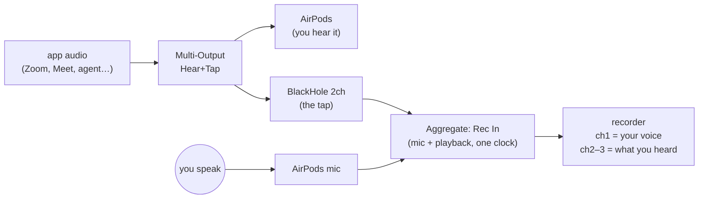
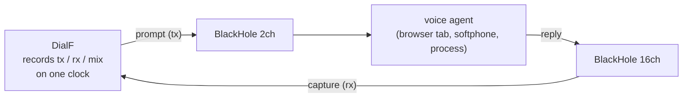

# Let Your AI Agent Be Your Audio Engineer

*Recording calls, podcasts, and voice-AI tests on your Mac — wired by a
prompt, no audio engineering degree required.*

Everyone who records anything on a Mac hits the same wall eventually:

- You interview a guest over Zoom and want **your voice and theirs on
  separate tracks** for editing — but your recording only has one side.
- You're on AirPods and want to **capture a call exactly as you heard it**.
- You're a developer testing a **voice AI agent** and need to feed it audio
  and record its replies, reproducibly.

The Mac can do all of this natively — no paid apps — but the setup lives in
a utility called Audio MIDI Setup: aggregate devices, multi-output devices,
clock sources, drift correction, sample rates. Checkboxes upon checkboxes.
It drives people crazy, and next month you get to re-remember all of it.

Here's the new way: **describe what you want to an AI coding agent, and let
it do the wiring.**

## The zero-learning path

If you have Claude Code, Codex, or any
coding agent that can run commands, you don't need to understand anything
below. The workflow is four steps, **in this order** — it matters:

**1. Install the tools.** audictl is one command; BlackHole is a normal Mac
installer (your agent can fetch it, but the installer asks for your
password — that click is yours):

```sh
npm install -g @agora-build/audictl @agora-build/dialf
brew install blackhole-2ch blackhole-16ch     # or download from existential.audio
```

**2. Plug everything in.** Pair the AirPods, connect the headset, plug in
the interface — *before* asking for anything. An agent can only wire
devices it can see; hardware that isn't connected doesn't exist to
CoreAudio.

**3. Have the agent take inventory.** Paste:

> Run `audictl list` and tell me what audio devices I have.

Now the agent knows your world by real names — "Hai's AirPods Pro", not a
guess — and everything it builds will reference devices that actually exist.

**4. Say what you want, in plain English.** From here the agent handles all
of it — wiring, verifying, recording, and cleaning up afterwards:

> Read https://github.com/Agora-Build/audictl/blob/main/docs/blog/ai-audio-engineer.md
> and set up my Mac so my next call is recorded with my mic and the other
> side on separate tracks. I'm on AirPods. Undo everything when I say done.

> Read that same page and set up Case 2 for testing my voice agent at
> 48 kHz, then run the DialF eval.

Everything the agent runs is safe to repeat (commands are no-ops when
already done), nothing touches your files, and every step is a one-liner to
undo.

The rest of this post is what the agent (or you, if you're curious)
actually does. Humans welcome; it's shorter than the checkbox maze.

## The kit

Three free pieces:

- [**audictl**](https://github.com/Agora-Build/audictl) — Audio MIDI Setup
  as a command line: devices, defaults, sample rates, aggregate and
  multi-output devices with clock and drift control. JSON output, meaningful
  exit codes, idempotent — built so AI agents can drive it safely.
- [**BlackHole**](https://existential.audio/blackhole/) — a virtual audio
  cable. Anything played into it can be recorded from it. The 2ch and 16ch
  variants are two independent cables, so input and output never collide.
- [**DialF**](https://www.npmjs.com/package/@agora-build/dialf)
  (`@agora-build/dialf`) — plays prompt audio, captures replies, records
  tx/rx/mix on one clock. Built for voice-agent evals.

---

## Case 1 — Record both sides of a call or interview

*For podcasters, journalists, anyone taking calls on a headset.* One
recording, in sync: channel 1 is your voice, channels 2–3 are what you heard
(your guest, the other side, the meeting). Split them afterwards and edit
each side separately.

**Prompt to paste:** *"Set up my Mac to record my next call: my AirPods mic
and everything I hear, as separate channels in one file."*

What that builds:



The commands (fuzzy names are fine — audictl resolves them, and lists
candidates if a name is ambiguous):

```sh
# Output side: play to your ears AND into the tap
audictl multi create --name "Hear+Tap" --devices "AirPods,BlackHole 2ch" --primary "AirPods"
audictl default set output "Hear+Tap"

# Input side: mic + tap glued into one recordable device.
# BlackHole is the stable clock; drift-correct the Bluetooth side.
audictl aggregate create --name "Rec In" --devices "AirPods,BlackHole 2ch" \
        --clock "BlackHole 2ch" --drift "AirPods"

# Keep everyone on one rate
audictl rate set "BlackHole 2ch" 48k
```

Record from "Rec In" with anything — QuickTime and GarageBand can select it
as the input device, or from the terminal:

```sh
sox -t coreaudio "Rec In" call.wav          # everything, in sync
sox call.wav mic.wav   remix 1              # your voice
sox call.wav heard.wav remix 2,3            # what you heard
```

(Or point DialF at it: `capture_device: "Rec In"` with `record_dir` and
`mix_recording: true` in `~/.config/dialf/config.yaml`.)

Done recording? Teardown is idempotent — safe to run twice:

```sh
audictl default set output "AirPods"
audictl aggregate destroy "Rec In" --if-exists
audictl multi destroy "Hear+Tap" --if-exists
```

---

## Case 2 — Eval a voice AI agent, no phone required

*For developers.* Your voice agent runs on (or is reachable from) your Mac —
a browser tab, a softphone, a local process. You want deterministic evals:
play a scripted prompt, capture the reply, measure latency. No cellular in
the loop, so results are reproducible.

**Prompt to paste:** *"Set up the Case 2 rig from this page for my voice
agent, sample rate 44.1k, and run the DialF eval job."*

Two cables, one per direction:



### Preflight, agent-runnable

Every command is idempotent (`changed:false` on re-run) and exit codes are
meaningful, so this runs unconditionally before every eval:

```sh
#!/usr/bin/env bash
set -euo pipefail

# Devices present? (exit 2 = not found)
audictl info "BlackHole 2ch"  --quiet || { echo "install BlackHole 2ch";  exit 1; }
audictl info "BlackHole 16ch" --quiet || { echo "install BlackHole 16ch"; exit 1; }

# Match DialF's configured rate (validates against supported rates, exit 4 if not)
audictl rate set "BlackHole 2ch"  44.1k --quiet
audictl rate set "BlackHole 16ch" 44.1k --quiet

# If the agent app uses system defaults, point them at the cables:
audictl default set input  "BlackHole 2ch"  --quiet
audictl default set output "BlackHole 16ch" --quiet
```

(If the agent app has its own device picker, select the BlackHole devices
there instead of moving the system defaults.)

### DialF config

`~/.config/dialf/config.yaml`:

```yaml
audio:
  sample_rate: 44100
  channels: 1
  capture_device: "BlackHole 16ch"      # the agent's output
  playback_device: "BlackHole 2ch"      # the agent's input
  record_dir: ~/Dev/myEval/recordings
  mix_recording: true
  capture_cmd: ["/opt/homebrew/bin/sox", "-q", "-t", "coreaudio", "BlackHole 16ch",
                "-t", "raw", "-b", "16", "-e", "signed-integer",
                "-r", "{rate}", "-c", "{channels}", "-", "remix", "1"]
  playback_cmd: ["/opt/homebrew/bin/sox", "-q", "-V1", "{file}",
                 "-t", "coreaudio", "BlackHole 2ch"]
```

### The eval job

`jobs/audio-inject-record.yaml` — each turn plays a prompt (recorded as tx),
then waits for the agent to speak and stop (rx):

```yaml
- type: audio.play
  file: ./samples/EN_Responding_Latency_Samples_loop30_Interval_10s.wav
  description: turn 1 — prompt the agent

- type: log
  message: audio injection eval complete
```

```sh
dialf run jobs/audio-inject-record.yaml    # audio-only: no --device, no phone
```

Afterward, cross-correlate tx against rx: the gap between tx-end and rx-onset
is the agent's response latency, on a clean digital path. (For the real
earpiece/codec/acoustic path, keep a phone + sound-card rig; this setup
measures the agent itself.)

### Want to listen in while the eval runs?

The agent's output goes into a virtual cable — silent by default. Tap it the
same way as Case 1:

```sh
audictl multi create --name "Eval Monitor" --devices "BlackHole 16ch,MacBook Pro Speakers"
```

…and have the agent output to "Eval Monitor": DialF still captures from
BlackHole 16ch, and your speakers get a copy.

---

## Notes for coding agents

If you are Claude, Codex, or another coding agent reading this because a
human pasted it to you: audictl was designed for you. The contract, in
brief — full spec in
[SCHEMA.md](https://github.com/Agora-Build/audictl/blob/main/SCHEMA.md):

- Add `--json` to every command. You get
  `{"ok":true,"schemaVersion":1,"changed":…,"data":{…}}` on stdout — success
  and error envelopes both, so capture one stream only.
- **Mutations are idempotent** and return the resulting state. Re-running a
  satisfied command is `ok:true, changed:false`, exit 0 — run setup scripts
  unconditionally; don't pre-check.
- **Exit codes**: 2 device not found, 3 ambiguous selector, 4 unsupported
  (includes invalid sample rate, with valid rates in
  `error.details.available`), 5 CoreAudio error, 6 timeout.
- On `AMBIGUOUS_DEVICE`, the error's `details.candidates` lists id/uid/name —
  retry with the UID. **Store UIDs, never numeric ids** (ids change; notably
  aggregates get a new id after every composition edit).
- `audictl list --json` is your discovery step; `audictl aggregate --json`
  shows every aggregate's members, clock, and drift flags.
- Clean up with `destroy --if-exists` / `remove --if-absent-ok`, and restore
  the user's default devices when the session ends — leave the machine as
  you found it.
- Rule of thumb for rigs: **BlackHole as the clock source, drift correction
  on Bluetooth/USB sub-devices**; set every device in a rig to one sample
  rate before recording.
- Substitute the user's real device names: `audictl list` first, then build.

## More scenarios

The two cases compose — tell your agent what you want and it can adapt:

- **Podcast with a remote guest** — Case 1 with Zoom/Meet: you on one track,
  guest on the others, edit each side independently.
- **Streaming / screen recording with app audio** — tap any app's sound into
  OBS or QuickTime while still hearing it (Case 1's output half alone).
- **React / commentary videos** — record the video's audio and your mic
  commentary as separate channels, no desk mixer.
- **Agent-vs-agent** — two AI agents talking: one's output cable is the
  other's input cable, DialF taps both.
- **CI voice tests** — a Mac mini runner where the preflight script *is* the
  fixture; `--private` aggregates keep the runner's device list clean.
- **Whole-house audio** — `multi create` with every AirPlay/HDMI output;
  drift correction keeps rooms in sync.

Whatever the variation, the ask is one sentence: *"read
https://github.com/Agora-Build/audictl and wire my Mac to record ___."*
Your audio engineer is in.
